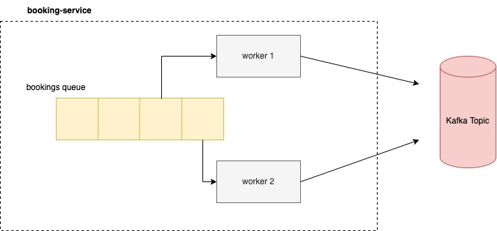

This project is an integration of two services actualized through the utilization of Kafka.

The CQRS architecture is used to organize the design of the two services. The `booking-service` 
is the Read API. The `payment-service` is the Write API.

Below is a diagram demonstrating the design for this project:

The `booking-service` responds to "create booking" calls by sending the request to a queue. Then, if the message is 
successfully added to the queue, a true message is sent to the client.

The queue is a shared memory data structure between threads that send--or produce--the event to the Kafka topic.

This functionality is implemented in the `BookingQueueService`, which is depicted in the diagram below:

The following is pending development:

- MySQL database for users, payments, bookings, and listings (integrated with Write API)
- Redis sets and hashes, involving above data, that support the required queries (integrated with Read API)
- replication service between MySQL and Redis that updates Redis in real-time when changes are made to the MySQL database
- save failed booking calls to a retry table (and nightly cron job)