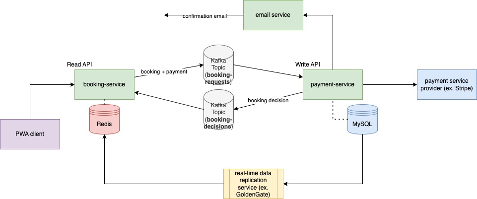

This project is an integration of two services actualized through the utilization of Kafka.

The CQRS architecture is used to organize the design of the two services. The `booking-service` 
is the Read API. The `payment-service` is the Write API.

Below is a diagram demonstrating the design for this project:

Let's zoom in into the booking-request to booking-decision flow.

The `booking-service` handles calls to create a booking by sending them to the `booking-requests` topic.

The `payment-service` receives the request. Then, it makes a decision on the booking request and sends it through the 
`booking-decisions` topic back to the booking-service.

However, imagine multiple concurrent calls to the booking service. How will the decision for one request be 
distinguished from another? In other words, after some period of waiting for the booking decision, how do we determine 
which decision is associated with which client request, once we've received it?

A key is used to identify each booking transaction. The producer event is sent with this key to the `booking-requests` 
topic.

So then, imagine multiple threads waiting for their respective decision. Each of these decisions are added to a map with 
the aforementioned key as the map key. The key is mapped to an object that contains a signal and a decision (which is 
null until it is received and set by the KafkaListener).

The request is sent and then received by the `payment-service`, which is waiting on the `booking-requests` topic. After 
processing the booking request it comes to a decision. This decision is then sent through the `booking-decisions` topic 
with the same key that the original booking request came with.

A listener is configured on the booking-service to consume messages coming through the booking-decisions topic. Thus, 
both services act as producers and consumers.

When a booking decision is received, the key is used to get the corresponding booking-decision from the map. The notify() 
method is called on the signal, which then wakes up the corresponding thread that initially sent the booking-request.

Also, the booking decision is set on this object in the map.

Hence, when the thread wakes up, it can find the decision it was waiting for in the map.

Here is a diagram depicting the flow:

The following is pending development:

- MySQL database for users, payments, bookings, and listings (integrated with Write API)
- Redis sets and hashes, involving above data, that support the required queries (integrated with Read API)
- replication service between MySQL and Redis that updates Redis in real-time when changes are made to the MySQL database
- save failed booking calls to a retry table (and nightly cron job)