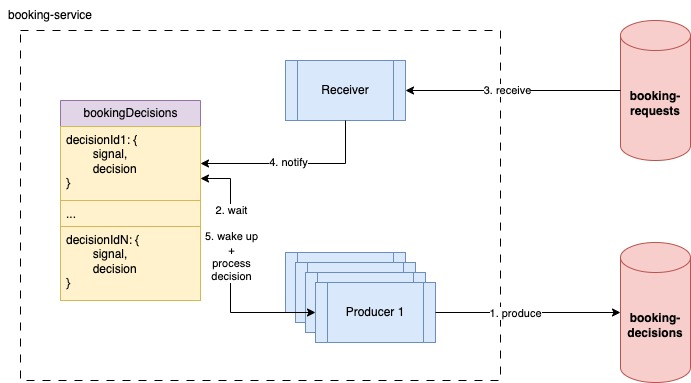

This project is an integration of two services actualized through the utilization of Kafka.

The CQRS architecture is used to organize the design of the two services. The `booking-service` 
is the Read API. The `payment-service` is the Write API.

Below is a diagram demonstrating the design for this project:

Let's zoom in into the booking-request to booking-decision flow.

The `booking-service` handles calls to create a booking by sending them to the `booking-requests` topic. Then, it waits 
for the decision by listening on the `booking-decisions` topic.

The `payment-service` receives the request. Then, it makes a decision on the booking request and sends it through the 
`booking-decisions` topic back to the booking-service.

However, imagine multiple concurrent calls are waiting. We need a way to identify each booking decision and associate it 
with the corresponding waiting process.

Here is where the "booking key" comes in.

The messages between the two topics are sent along with this unique booking key.

When the decision is received, the key that it comes with is used to notify the corresponding thread.

Here is a diagram to depict this process:

The producer first sends the booking request to the `booking-requests` topic. Then, it adds an object depicted in the 
bookingDecisions map above. After it adds the object, it calls the wait() method on the signal param.

When the receiver gets a new message, remember that each message comes in with a key associated with it. This key is 
used to search into the `bookingDecisions` map and retrieve the corresponding object. The message is assigned to the 
decision parameter. Then, the notify() method is called, which wakes up the process that called wait() on this signal.

When the process wakes up, it now finds the decision data in the map. So now, it can process the decision and return the 
decision back to the client (whether the booking is successful or not).

The following is pending development:

- MySQL database for users, payments, bookings, and listings (integrated with Write API)
- Redis sets and hashes, involving above data, that support the required queries (integrated with Read API)
- replication service between MySQL and Redis that updates Redis in real-time when changes are made to the MySQL database